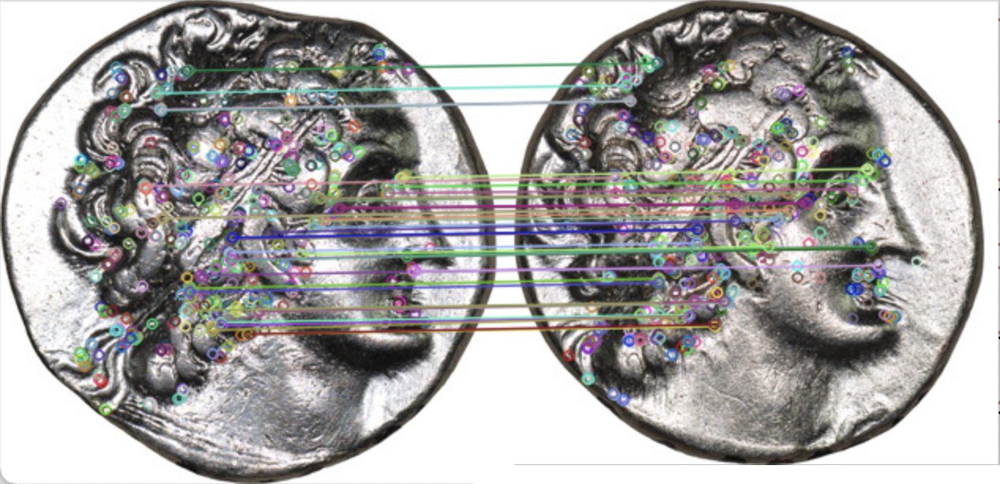

# Computer-Aided Die Study (CADS)

The Computer-Aided Die Study (CADS) is a new way to conduct [die studies](https://youtu.be/VoBUVOUuvRA) using computer vision techniques. This project is a continuation and re-imagining of [previous efforts](https://numismatics.org/pocketchange/cads/) by the American Numismatic Society to create a computational die study program, with the added intention of producing a user-friendly tool numismatists can use for their research.

The primary goal of CADS is to vastly reduce the time required for numismatists to conduct die studies. Die studies are traditionally conducted by hand, and are one of the most arduous tasks a numismatist can undertake. With CADS, the time required can be reduced from months-to-years to only a few hours of work.

This project has been developed in collaboration with the [American Numismatic Society](https://numismatics.org/). 

You can view a talk on CADS [here](https://youtu.be/wF6aZdhc0wg), or read about it [here](https://digitalcommons.trinity.edu/compsci_honors/54).

## Building

A pre-compiled version of `opencv.js` is included out-of-the-box, but you can use `dev/build_opencvjs_linux.sh` to compile it yourself on a linux machine. It will install the necessary toolchain. Be sure to have Python 2.7.x installed before running.

## Running

To run the application from source, simply `npm install` to get the dependencies, then `npm start`. This will bring up an Electron window.
